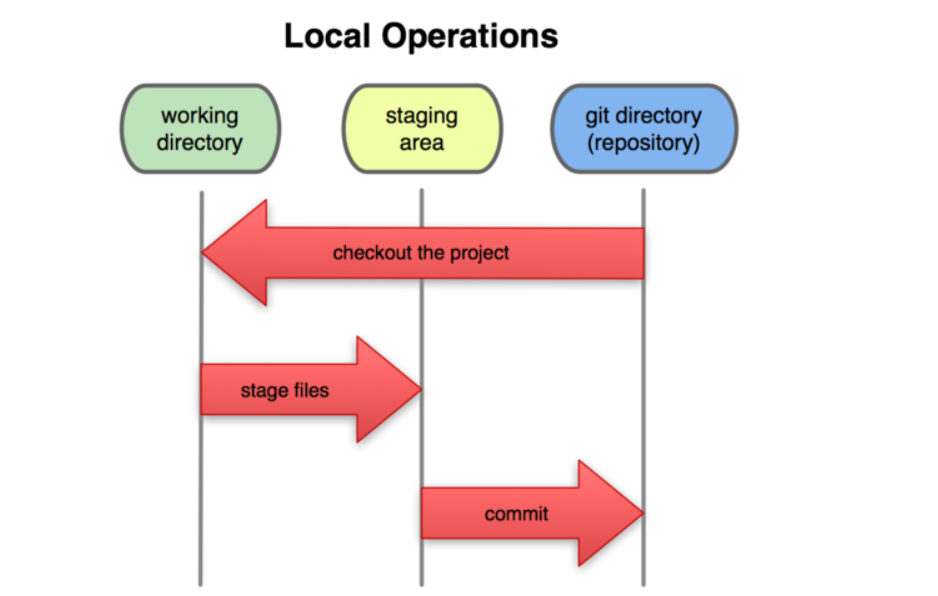
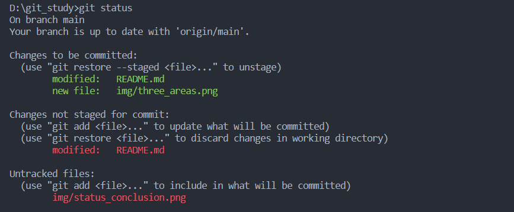
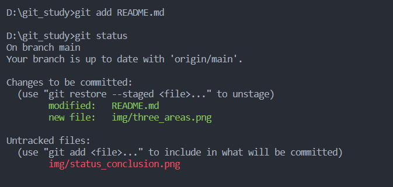

# git

## 安装好后第一步需要配置用户名和email

```git
git config --global user.name "xxx"
git config --global user.email xxx
```

## 文件的三种状态

* 已提交（committed）
* 已修改（modified）
* 已暂存（staged）

于此相对应，文件会在三个区域流动

* working directiory
* staging area
* git dictionary



## 工作流程

1. 在working directory中修改文件
2. 修改之后对文件进行快照，保存到暂存区域
3. 提交更新，将暂存的文件快照永久转存到git directory

## git基础指令

### 1.检查当前文件状态

```git
git status
```

效果如图：


### 2.跟踪（track）新文件

```git
git add */{filename}
```

效果如图:


### 3.忽略一些文件

有些文件我们不想用git管理那么我们就可以创建一个.gitignore文件