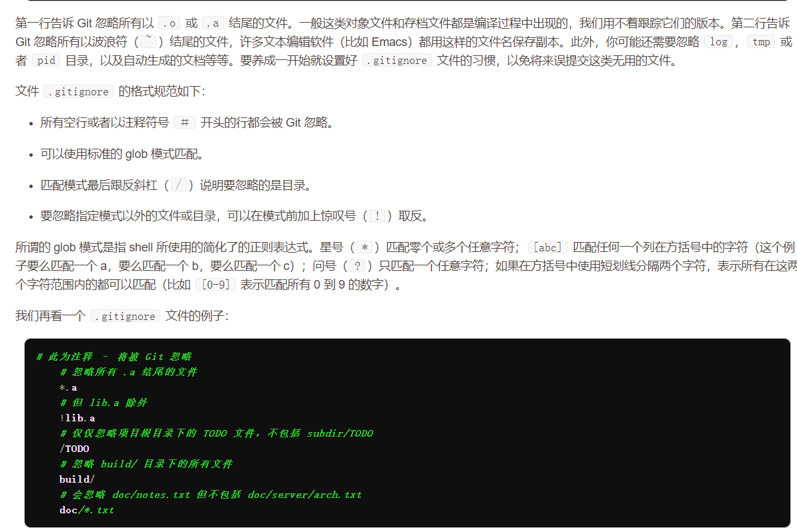
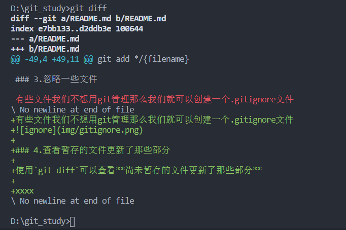
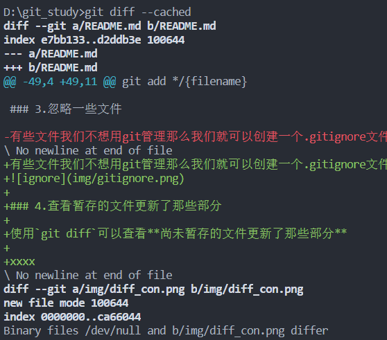
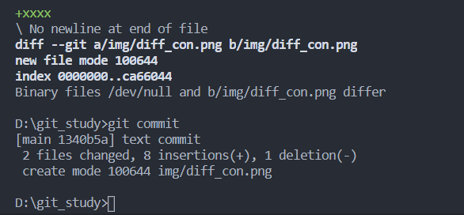
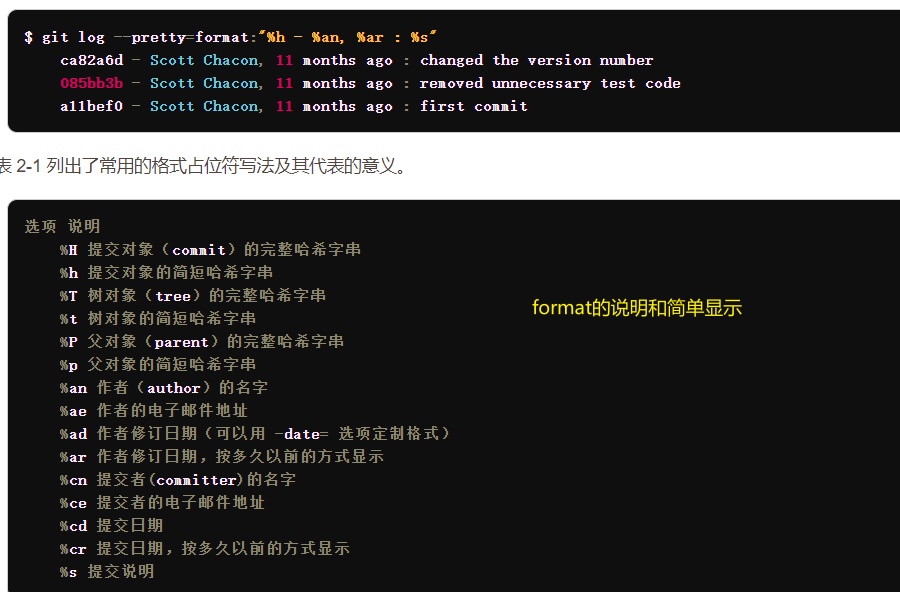
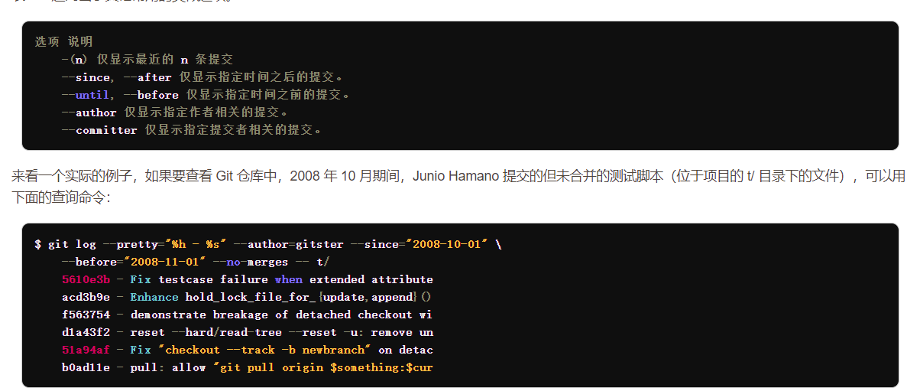

# git

[TOC]

## 安装好后第一步需要配置用户名和email

```git
git config --global user.name "xxx"
git config --global user.email xxx
```

## 文件的三种状态

* 已提交（committed）
* 已修改（modified）
* 已暂存（staged）

于此相对应，文件会在三个区域流动

* working directory
* staging area
* git directory


## 工作流程

1. 在working directory中修改文件
2. 修改之后对文件进行快照，保存到暂存区域
3. 提交更新，将暂存的文件快照永久转存到git directory

## git基础指令

### 1.检查当前文件状态

```git
git status
```

效果如图：


### 2.跟踪（track）新文件

```git
git add */{filename}
```

效果如图:


### 3.忽略一些文件

有些文件我们不想用git管理那么我们就可以创建一个.gitignore文件


### 4.查看暂存的文件更新了那些部分

使用`git diff`可以查看**尚未暂存的文件更新了那些部分**

效果：


使用`git diff --cached`可以查看**暂存和上次提交文件之间的差别**

效果：


### 5.提交（commit）更新

使用`git commit`，可以提交暂存文件到git directory
使用`-m`可以在后面添加描述信息
> 不添加`-m`在win中会进入vim来写描述

效果：

**使用 -a 可以跳过add直接提交文件**

### 6.移除文件

准确来说是从staging area中将文件移除，**或者说是取消对文件的跟踪**
使用`git rm xxx`,也可以使用glob模式

### 7.移动文件（git中的改名）

`git mv xxx  xxx`
git不对跟踪文件的移动以及命名修改，所以需要手动操作

### 8.查看历史

`git log`

可选指令|作用
-|-|
`-p`|显示每次提交的内容差异
`-数字`|显示最近n次的更新
`--stat`|显示简要的增改行数统计
`--pretty=oneline`|每个修改占一行
`--pretty=short/full/fuller`|
`--pretty=format:"xxx"`|输出特定格式
`--graph`|通过简单的图形展示分支和衍合
`--since=2.weeks`|显示最近两周的内容
==format演示==

==其他指令(other directive)==


### 9.撤销操作

如果漏掉文件，或者提交信息写作可以，可以使用`git commit --amend`命令来撤销上次提交

### 10.取消暂存文件

当使用`git add .`提交了不想提交的文件
那么可以使用`git reset HEAD {file}`来起效缓存

### 11.取消对文件的修改
使用`git checkout -- {file}`的命令来将working dirctory 中的某个文件 修改为 staged dirctory中的样子
